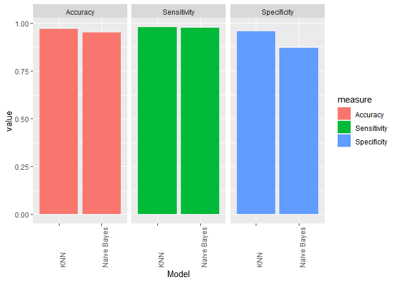

KNN and Naive Bayes for Wisconsin Breast Cancer Diagnistic Data
================

\##Loading Required Libraries

``` r
library(readxl)
library(class)
library(caret)
library(ggplot2)
library(corrplot)
library(dplyr)
library(tidyverse)
```

\##Dataset

``` r
breast_cancer_data <- read_excel("D:/My Documents/pdf/R/data.R/breast cancer data.xlsx")
```

\##Preprocessing

``` r
wbcd <- data.frame(breast_cancer_data)
wbcd <- wbcd[-1]
round(prop.table(table(wbcd$diagnosis)) * 100, digits = 1)
```

    ## 
    ##    B    M 
    ## 62.8 37.2

``` r
set.seed(123)
wbcd <- wbcd[sample(nrow(wbcd)), ]
diagnosis <- factor(wbcd$diagnosis, levels = c("B", "M"),
                         labels = c("Benign", "Malignant"))
normalize <- function(x){
  return((x - min(x)) / (max(x) - min(x)))
}

wbcd <- as.data.frame(lapply(wbcd[2:31], normalize))
```

\##Training and Test sets

``` r
data_train <- wbcd[1:470, ]
data_test <- wbcd[471:570, ]
diagnosis_train <- diagnosis[1:470]
diagnosis_test <- diagnosis[471:570]
```

\##Blocs for K-Fold Cross Validation

``` r
K <- 10
folds <- cut(seq(1, nrow(data_train)), breaks = K, labels = FALSE)
```

\##Function for ConfusionMatrix

``` r
statistics <- function(Actual, Predicted) {
  confusion.table <- table(Actual = Actual, Predicted = Predicted)
  output <- list(confusion.table =confusion.table)
  TN <- confusion.table[1]
  FN <- confusion.table[2]
  FP <- confusion.table[3]
  TP <- confusion.table[4]
  output$accuracy <- (TP+TN)/sum(confusion.table)
  output$precission <- (TP)/(TP+FP)
  output$sensitivity <- (TP)/(TP+FN)
  output$specificity <- (TN)/(TN+FP)
  output$FPR <- (FP)/(TN+FP)
  
  return(output)
}
```

\##Performing K-Fold Cross Validation for KNN

``` r
k <- 55
testAccuracy <- matrix(data = NA, nrow=K ,ncol = k)
trainAccuracy <- matrix(data = NA, nrow=K ,ncol = k)
testPrecission <- matrix(data = NA, nrow=K ,ncol = k)
testSensitivity <- matrix(data = NA, nrow=K ,ncol = k)
testSpecificity <- matrix(data = NA, nrow=K ,ncol = k)

start_time <- Sys.time()
for(i in 1:K){
  
  #define trainig and testing data
  
  testIndexes <- which (folds == i, arr.ind = TRUE) 
  
  testData <- data_train[testIndexes,] 
  test_labels <- diagnosis_train[testIndexes]
  trainData <- data_train[-testIndexes,]
  train_labels <- diagnosis_train[-testIndexes]

#use k-fold cv to evaluate models
  
for (j in 1:k){
    testPred <- knn(train = trainData, test = testData, 
                    cl = train_labels, k = j)

testAccuracy[i, j] <- statistics(Actual = test_labels, Predicted = testPred)[[2]]

trainPred <- knn(train = trainData, test = trainData, 
                    cl = train_labels, k = j)

trainAccuracy[i, j] <- statistics(Actual = train_labels, Predicted = trainPred)[[2]]

testPrecission[i, j] <- statistics(Actual = test_labels, Predicted = testPred)[[3]]
testSensitivity[i, j] <- statistics(Actual = test_labels, Predicted = testPred)[[4]]
testSpecificity[i, j] <- statistics(Actual = test_labels, Predicted = testPred)[[5]]

   } 
  
}
```

\##Accuracy Plot

``` r
Metric <- data.frame(c(rep("training", k), rep("test", k)), rep(seq(1:k), 2), 
c(colMeans(trainAccuracy), colMeans(testAccuracy)))
colnames(Metric) <- c("Data", "k", "Accuracy")

Metric %>%
ggplot(aes(x = k, y = Accuracy, group = Data, colour = Data)) +
  geom_line() +
  geom_point() +
   ggtitle("Training and Test Accuracy for KNN") + theme(plot.title = 
 element_text(color="black", face="bold", size=16)) 
```

<!-- -->

\##Metrics Data Frame

``` r
Metrics <- data.frame(k = 1:55, accuracy = colMeans(testAccuracy), 
precission = colMeans(testPrecission), sensitivity = colMeans(testSensitivity), specificity = colMeans(testSpecificity))
odd_k_Metrics <- Metrics[seq(1, 55, by = 2), ]
odd_k_Metrics
```

    ##     k  accuracy precission sensitivity specificity
    ## 1   1 0.9553191  0.9461966   0.9217116   0.9705547
    ## 3   3 0.9680851  0.9817116   0.9245186   0.9899500
    ## 5   5 0.9702128  0.9888545   0.9245186   0.9929803
    ## 7   7 0.9638298  0.9750450   0.9195186   0.9868250
    ## 9   9 0.9744681  0.9928571   0.9297818   0.9969697
    ## 11 11 0.9702128  0.9941176   0.9178520   0.9964286
    ## 13 13 0.9680851  1.0000000   0.9057091   1.0000000
    ## 15 15 0.9680851  1.0000000   0.9057091   1.0000000
    ## 17 17 0.9617021  0.9928571   0.8923758   0.9968750
    ## 19 19 0.9595745  0.9928571   0.8864934   0.9968750
    ## 21 21 0.9595745  0.9928571   0.8864934   0.9968750
    ## 23 23 0.9574468  0.9923077   0.8809379   0.9968750
    ## 25 25 0.9553191  0.9923077   0.8742712   0.9968750
    ## 27 27 0.9553191  0.9923077   0.8742712   0.9968750
    ## 29 29 0.9531915  0.9923077   0.8676046   0.9968750
    ## 31 31 0.9510638  0.9923077   0.8623414   0.9968750
    ## 33 33 0.9510638  0.9923077   0.8623414   0.9968750
    ## 35 35 0.9531915  0.9923077   0.8676046   0.9968750
    ## 37 37 0.9531915  0.9923077   0.8676046   0.9968750
    ## 39 39 0.9531915  0.9923077   0.8676046   0.9968750
    ## 41 41 0.9531915  0.9923077   0.8676046   0.9968750
    ## 43 43 0.9531915  0.9923077   0.8676046   0.9968750
    ## 45 45 0.9489362  0.9846154   0.8620490   0.9938447
    ## 47 47 0.9468085  0.9755245   0.8620490   0.9907197
    ## 49 49 0.9489362  0.9923077   0.8561666   0.9968750
    ## 51 51 0.9489362  0.9923077   0.8567222   0.9968750
    ## 53 53 0.9489362  0.9923077   0.8567222   0.9968750
    ## 55 55 0.9446809  0.9923077   0.8459035   0.9968750

\##Optimum Value for k

``` r
 k_opt <- which(odd_k_Metrics$accuracy == max(odd_k_Metrics$accuracy))
```

\##Predict with Finala Model

``` r
knn.model <- knn(train = data_train, test = data_test, 
                    cl = diagnosis_train, k = k_opt)

knn_cm <- statistics(Actual = diagnosis_test, Predicted = knn.model)
```

\##Naive Bayes

``` r
breast_cancer_data <- read_excel("D:/My Documents/pdf/R/data.R/breast cancer data.xlsx")
wbcd<-data.frame(breast_cancer_data)
wbcd<-wbcd[-1]
diagnosis <- wbcd$diagnosis <- factor(wbcd$diagnosis, levels = c("B", "M"),
                         labels = c("Benign", "Malignant"))
```

\##Removing Highly Corrolated Variables

``` r
sum(apply(cor(wbcd[, 2:31]), 2, function(x) sum(ifelse(x > 0.6, TRUE, FALSE))))
```

    ## [1] 238

``` r
corrplot(cor(wbcd[, 2:31]))
```

<!-- -->

``` r
cor_mat <- cor(wbcd[, 2:31])
cor_mat[upper.tri(cor_mat)] <- 0
diag(cor_mat) <- 0
wbcd <- wbcd[, 2:31][ , !apply(cor_mat,    
                           2, function(x) any(abs(x) > 0.6))]
corrplot(cor(wbcd[, -1]))
```

<!-- -->

\##Training and Test Sets

``` r
wbcd <- cbind(wbcd, diagnosis)
data_train <- wbcd[1:470, ]
data_test <- wbcd[471:570, ]
x <- data_train[, 1:8]
y <- data_train[, 9]
```

\##Performing K-Fold Cross Validation for Naive Bayes

``` r
train_control <- trainControl(method = "cv", number = 10)
grid <- expand.grid(usekernel = c(TRUE, FALSE), fL = 0:5, adjust = 
seq(0, 5, by = 1))
nb.model <- train(x = x, y = y, method = "nb", trControl = train_control, tuneGrid = 
grid, preProc = c("BoxCox", "center", "scale", "pca"))
```

\##Accuracy plot

``` r
plot(nb.model)
```

<!-- -->

\##Predict with Final model

``` r
pred <- predict(nb.model, newdata = data_test)
nb_cm <- confusionMatrix(pred, data_test[, 9])
```

\##Comparison of Two Models

``` r
com_metric <- data.frame(Model = c("KNN", "Naive Bayes"), Accuracy = 
c(knn_cm[[2]], nb_cm[[4]][2]), Sensitivity = c(knn_cm[[3]], 
nb_cm[[4]][3]), Specificity = c(knn_cm[[4]], nb_cm[[4]][3]))

complong <- gather(com_metric, key = "measure", value = "value", c("Accuracy", "Sensitivity", "Specificity"))

complong %>% 
  ggplot(aes(x = Model, y = value, fill = measure)) +
    geom_bar(stat = 'identity')+
theme(axis.text.x = element_text(angle = 90,hjust =0 )) +
  facet_wrap(~ measure)
```

<!-- -->

\##Conclusion

Two machine learning techniques, K-nearest neighbors (KNN) and Naive
Bayes, were used to classify a dataset of breast cancer into two
categories: Malignant and Benign KNN had a slightly higher accuracy,
sensitivity, and specificity than Naive Bayes. This suggests that KNN is
a better method for this particular dataset.
